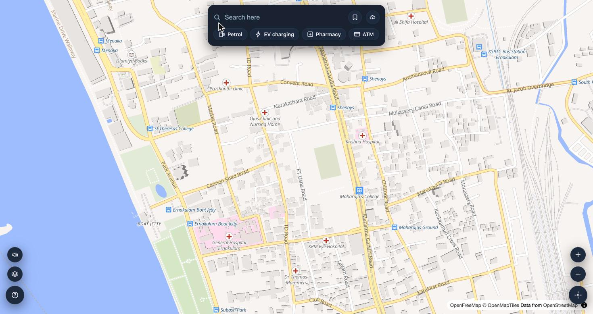
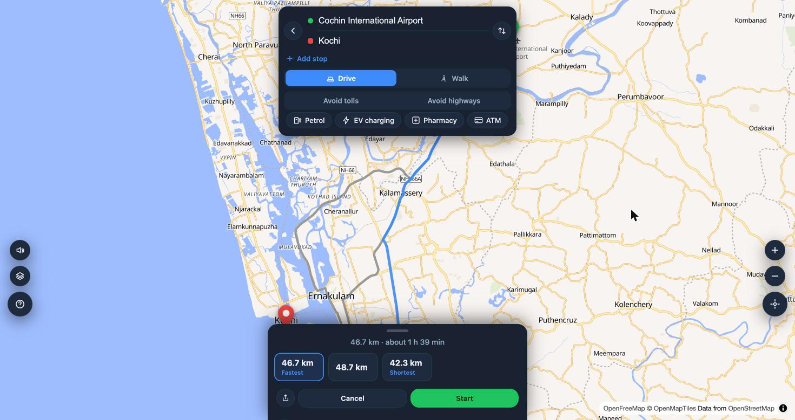
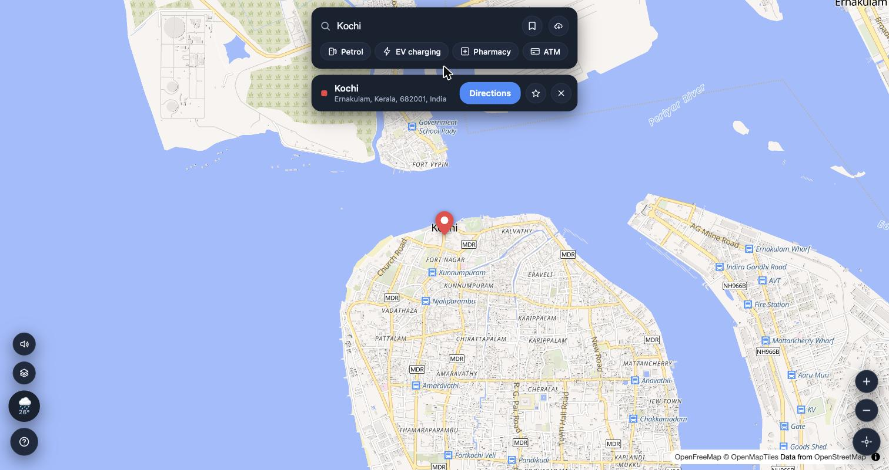
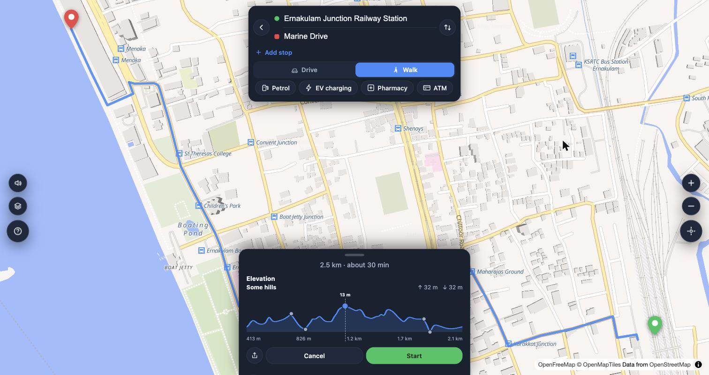
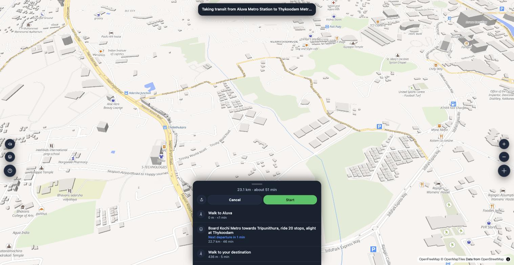
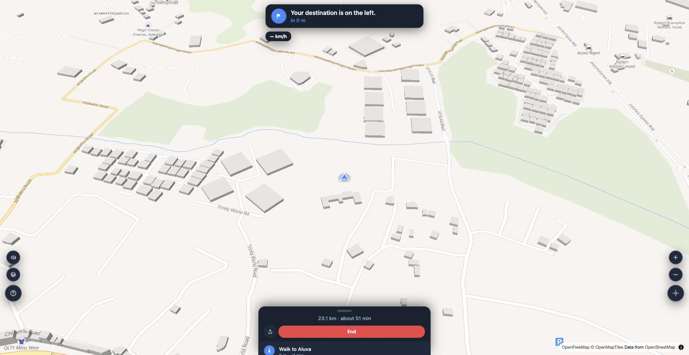

# Navigator

[](LICENSE)
[](https://github.com/siddharth2798/osm-navigator)

A personal, self-hosted turn-by-turn navigation web app for driving and walking, built on OpenStreetMap data. Single-user, no accounts, no sync, no server of your own beyond the geocoding/routing services you point it at.

Map rendering is [MapLibre GL JS](https://maplibre.org/) with tiles from [OpenFreeMap](https://openfreemap.org/). Geocoding is [Nominatim](https://nominatim.org/). Routing is [Valhalla](https://valhalla.github.io/valhalla/). Everything else — favorites, recent trips, offline map tiles, the in-progress-trip resume — lives entirely in the browser (IndexedDB / Cache API).

The app itself has a **Help & documentation** screen (the "?" button, bottom-left of the map) covering all of this from a user's perspective.

## Screenshots

<table>
<tr>
<td width="50%"></td>
<td width="50%"></td>
</tr>
<tr>
<td align="center">Search &amp; one-tap category chips</td>
<td align="center">Directions with route alternatives</td>
</tr>
<tr>
<td width="50%"></td>
<td width="50%"></td>
</tr>
<tr>
<td align="center">Place details &amp; weather at a glance</td>
<td align="center">Walk-mode elevation profile</td>
</tr>
<tr>
<td width="50%"></td>
<td width="50%"></td>
</tr>
<tr>
<td align="center">Kochi Metro itinerary with real next-departure time</td>
<td align="center">Live GPS tracking during the trip, turn-by-turn banner and all</td>
</tr>
</table>

## Features

- **Search** — typo-tolerant fallback, one-tap category chips (petrol, EV charging, pharmacy, ATM, hospital, food, parking, hotels), "X near me" resolves to your live GPS position. An "Open now" toggle (last chip in that same scrollable row — set it before tapping a category, not after) filters out anything closed per its OSM `opening_hours` tag, keeping unparseable ones rather than risk hiding a real result. Category searches that come back empty from Nominatim (EV charging especially, see [Known limitations](docs/LIMITATIONS.md)) fall back to TomTom's Places Search, when configured.
- **EV charging station details** via Open Charge Map — connector type, power, operator, cost, and an honestly-labeled operational status. Falls back to a plain OSM pin without a configured Open Charge Map key.
- **Paste a Google Maps link** — a full link or `maps.app.goo.gl` short link resolves straight to that place, including places with no street address (Plus Codes decode automatically). Also registers as an Android Share target.
- **Directions** — multi-stop routing (up to 8, drag to reorder), a plain-text "X to Y" shortcut, Drive/Walk/Transit modes, avoid-tolls/avoid-highways. Route cards lead with distance, not Valhalla's time estimate — that estimate has no live traffic behind it, unless TomTom live traffic is configured (see [Setup](docs/SETUP.md)).
- **Kochi Metro + Kochi Water Metro routing**, bundled with real station/schedule data — no self-hosted transit server needed. Transit mode plans a real walk-or-drive-to-station, ride, walk-or-drive-to-destination itinerary using each system's own actual timetable, showing the real next-departure time on the ride leg. Tap "Start" on a planned trip for live GPS tracking through every leg — a real turn-by-turn banner on the walk/drive portions, then a "next stop"/stops-remaining readout on the metro or a percent-of-distance readout on the water metro, the same live-puck experience drive/walk mode already has. See [docs/KOCHI_TRANSIT.md](docs/KOCHI_TRANSIT.md) for where the data comes from, how live tracking decides you've boarded, and its caveats. A self-hosted [OpenTripPlanner 2](https://www.opentripplanner.org/) instance can cover a different city's transit (planning/rendering only, no live tracking) on top of this.
- **Long-press to pin a place** (4-second press) — fills the search box, or sets it as the destination directly if you're already mid-trip.
- **Your location, always visible** — a live "you are here" marker with a heading wedge, shown automatically as soon as GPS resolves, toggleable from the locate button.
- **Satellite view**, **Home & Work shortcuts**, **elevation profile** for walking routes — plus, on this experimental branch (not yet on `main`), spoken incline heads-up cues, a steep-route advisory, per-alternative elevation badges, and a live effort readout (see [Known limitations](docs/LIMITATIONS.md)).
- **Turn-by-turn navigation** — live position arrow, traveled-route dulling, screen stays awake, automatic arrival detection, survives a mid-drive reload, reroutes onto whatever road you actually took. Auto-enters **Picture-in-Picture** on the [Android shell](docs/ANDROID.md) when minimized mid-drive.
- **Voice guidance** — early and near turn prompts scaled to your actual speed, natural phrasing, an on/off toggle, a distinct alert tone on deviation, combined prompts for closely-spaced turns.
- **Live traffic** — when configured, every route option (even a single one with no alternates) is compared against current TomTom traffic before you even start, so "Fastest" reflects real conditions rather than Valhalla's traffic-blind time estimate. If the fastest option is congested somewhere Valhalla's own alternates don't route around, the app also tries forcing a path past it and adds a genuinely new "Avoids traffic" option when that's actually faster. During driving, an occasional "Heavy traffic ahead" indicator and a traffic-adjusted ETA; if a real alternate is genuinely faster, the app reroutes to it automatically (announced out loud) rather than just recalculating the same route.
- **Weather at a glance**, **search along the route**, **favorites & recent trips**, **offline map tiles**, **shareable route links** (no backend involved), **street-level imagery** via Mapillary when configured.
- Works with the screen off via the [optional Android shell](docs/ANDROID.md).

## Running it

No build step. Clone or copy the folder, serve it as static files, open it in a browser:

```
python3 -m http.server 8080
# then open http://localhost:8080/index.html
```

See [docs/SETUP.md](docs/SETUP.md) for configuring your own services and deploying your own copy.

## Documentation

- [Privacy](docs/PRIVACY.md) — what leaves your device, and to whom.
- [Self-hosting & configuration](docs/SETUP.md) — running it, configuring services, deploying, data freshness.
- [Kochi Metro + Kochi Water Metro transit](docs/KOCHI_TRANSIT.md) — where the bundled data comes from, its caveats, and how to regenerate it.
- [The optional Android shell](docs/ANDROID.md) — building, installing, and running the native Android wrapper.
- [Troubleshooting](docs/TROUBLESHOOTING.md)
- [Known limitations](docs/LIMITATIONS.md)

## Contributing

Bug reports and pull requests are welcome via [GitHub Issues/PRs](https://github.com/siddharth2798/osm-navigator) — see [CONTRIBUTING.md](CONTRIBUTING.md) for scope and what's explicitly out of scope before opening a PR that adds it.

## License

[MIT](LICENSE) — do whatever you want with it, including your own fork with your own services configured.
